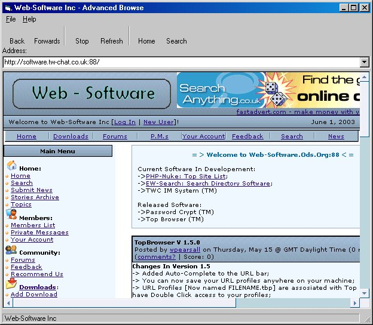



## Advanced Browse

### Description

This code allows you to control all new windows within your application.

EVEN those pesky little Ctrl + N windows.

This code isn't the best code, and i plan on adding alot more functionality to it. [IE: Favorites, ETC] But at least it shows you how to do basic stuff.

This app also has an Auto-Complete URL Bar...

And displays how to tell your users that it is a secure site.

 

Update (15/06/2003):

Also: I have added a "Text Size" Menu to the webbrowser, for zooming the text, like within internet explorer, and some other basic functions.
 
### More Info
 
You need to enable KeyPreview for your browser form,

Then enter the code into the KeyDown of the form, which is in my form's key-down...

             |
---                |---
**Submitted On**   |2003-06-01 14:09:18
**By**             |[Wayne Pearsall](https://github.com/Planet-Source-Code/PSCIndex/blob/master/ByAuthor/wayne-pearsall.md)
**Level**          |Intermediate
**User Rating**    |4.8 (29 globes from 6 users)
**Compatibility**  |VB 5\.0, VB 6\.0
**Category**       |[Internet/ HTML](https://github.com/Planet-Source-Code/PSCIndex/blob/master/ByCategory/internet-html__1-34.md)
**World**          |[Visual Basic](https://github.com/Planet-Source-Code/PSCIndex/blob/master/ByWorld/visual-basic.md)
**Archive File**   |[Advanced\_B1600976142003\.zip](https://github.com/Planet-Source-Code/wayne-pearsall-advanced-browse__1-45874/archive/master.zip)

